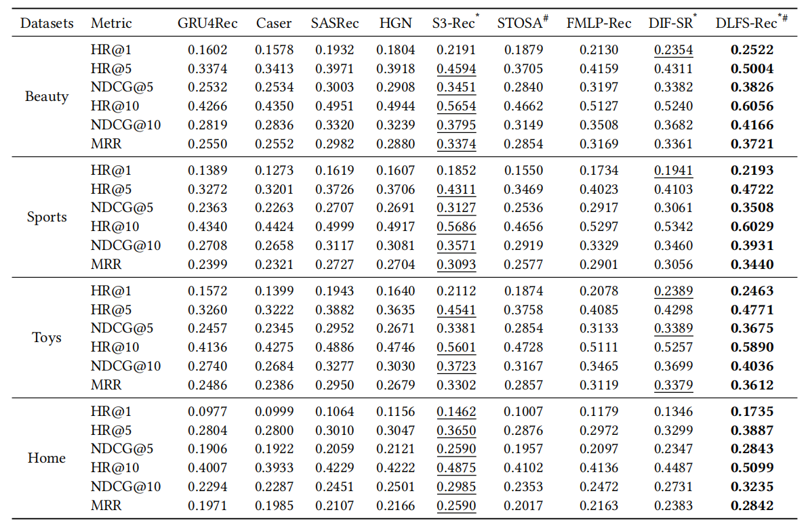

# DLFS-Rec
Source code for our RecSys 2023 Paper [**"Distribution-based Learnable Filters with Side Information for Sequential Recommendation"**](https://dl.acm.org/doi/10.1145/3604915.3608782) .

If you find the code helpful for your research, please cite our paper:

```bash
@inproceedings{liu2023distribution,
  title={Distribution-based Learnable Filters with Side Information for Sequential Recommendation},
  author={Liu, Haibo and Deng, Zhixiang and Wang, Liang and Peng, Jinjia and Feng, Shi},
  booktitle={Proceedings of the 17th ACM Conference on Recommender Systems},
  pages={78--88},
  year={2023}
}
```

## Architecture


## Performance
The ground-truth item is paired with 99 randomly sampled negative items, and performance comparisons are presented in the following picture.



## Training
The values of hyperparameters can be determined based on specific circumstances. For optimal parameters related to experimental results, please refer to the readme file in 'reproduction' folder.

```shell script
python main.py \
--data_name data_name \
--hidden_size 128 \
--num_hidden_layers 2 \
--hidden_dropout_prob 0.5 \
--attribute_hidden_size 128 \
--lr 0.0001
```

## Contact
If you have any questions about our paper or codes, please send email to zhixiang123.deng@gmail.com.